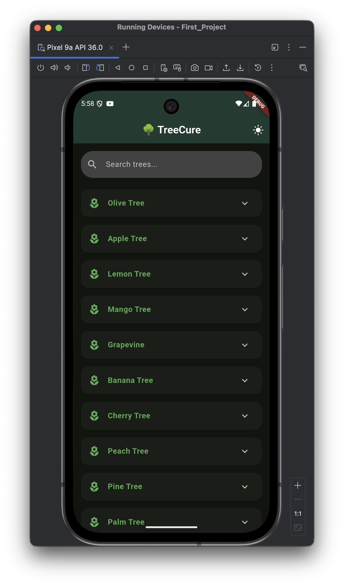
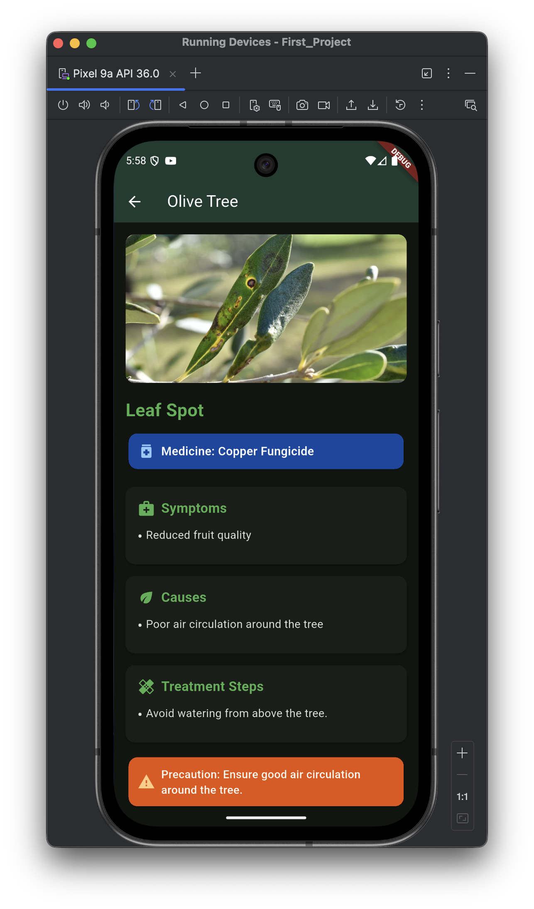

# FirstFlutterProject

A starter Flutter app created by @JpTamer. This repository contains the source code and resources for a simple Flutter application intended to demonstrate project structure, common commands, and how to build and run the app locally.

## Features

- Flutter (Dart) mobile app scaffold
- Example screens and navigation
- Basic state management and assets

## Getting started

These instructions help you get a copy of the project up and running on your local machine for development and testing purposes.

### Prerequisites

- Flutter SDK (>= 3.0)
- Dart (comes with Flutter)
- Android Studio or VS Code (recommended)
- An Android or iOS device/emulator

Install Flutter: https://flutter.dev/docs/get-started/install

### Clone the repository

```bash
git clone https://github.com/JpTamer/FirstFlutterProject.git
cd FirstFlutterProject
```

### Install dependencies

```bash
flutter pub get
```

### Run the app

Start an emulator or connect a device, then:

```bash
flutter run
```

To build a release APK:

```bash
flutter build apk --release
```

## Project structure

- android/ - Android platform-specific code
- ios/ - iOS platform-specific code
- lib/ - Dart source files (app code)
- test/ - Unit and widget tests
- pubspec.yaml - Project metadata and dependencies

## Contributing

Contributions are welcome. Please open an issue to discuss major changes and submit pull requests for fixes and features.

## License

This project is provided "as-is". Add a license file (e.g., MIT) if you want to make it open source.

## Contact

Maintainer: @JpTamer

## Screenshots








